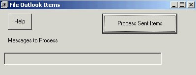



## File It

### Description

This is a followup to the previous code. After using the previous code to "harvest" all the email addresses from manually filed emails, it is now time to save time. After a week or so of answering emails, they really build up. More than 50% are emails from people who email us often and while we can store the emails/responses manually, this of course takes time. Now that we know (in the SQL db) the email address and know which folder they should be stored in, we can run this program to automatically move them there for us. Any emails that we don't have email address id's for will have to be moved manually but the next time they email back......So it'll really save some time if you get a ton of emails and they come from the same address most often.
 
### More Info
 
Sometimes it moves the emails to the root destination folder if it doesn't know what to do with them. Didn't bother to find out why since they have to be moved manually anyway.

             |
---                |---
**Submitted On**   |2001-01-05 14:15:20
**By**             |[Patrick Roth](https://github.com/Planet-Source-Code/PSCIndex/blob/master/ByAuthor/patrick-roth.md)
**Level**          |Intermediate
**User Rating**    |4.3 (13 globes from 3 users)
**Compatibility**  |VB 5\.0, VB 6\.0
**Category**       |[Complete Applications](https://github.com/Planet-Source-Code/PSCIndex/blob/master/ByCategory/complete-applications__1-27.md)
**World**          |[Visual Basic](https://github.com/Planet-Source-Code/PSCIndex/blob/master/ByWorld/visual-basic.md)
**Archive File**   |[CODE\_UPLOAD13414152001\.zip](https://github.com/Planet-Source-Code/patrick-roth-file-it__1-14159/archive/master.zip)

